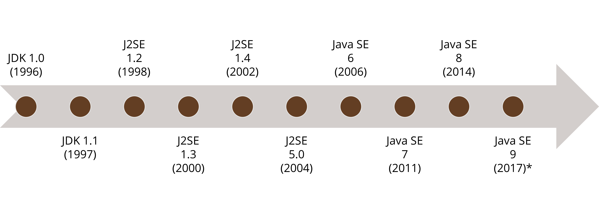

# Lecture 1
## Introduction to Java
> Use the arrow keys or the icons at the bottom right to navigate
---
## Outline
- Quick Overview of the Syllabus
- What is Java?
- MIT’s Processing Language
- Basic 2D Drawing
- Control Structures
- Variables and Data Types

---
> We write code for humans, not computers

---

## What is Java?

----

## What is Java?

- Java consists of three parts:
  - The Java Virtual Machine (JVM)
  - The Java Language
  - The Java Standard Library

----
### The Java Virtual Machine

  - Java was designed to be a "write once, run anywhere" language

  - Unlike C/C++, which are compiled to machine code that runs directly
  on your processor, Java programs are compiled to _byte-code_ that can
  run on the JVM

----
### The Java Virtual Machine
  - The
  [JVM](https://docs.oracle.com/en/java/javase/17/vm/java-virtual-machine-technology-overview.html) consists of
    - an adaptive compiler that converts Java into bytecode and, at runtime,
    continues to optimize the program based on real usage
    - memory management including allocations and garbage collection
    - multithreading and concurrency support

----
### The Java Language

  Java only has 50 keywords, and some of those are reserved but not used.

  
  |         |           |   |     |          |
  |---------|-----------|---|-----|----------|
  | abstract | continue | for | new | switch |
  | assert | default | goto | package | synchronized |
  | boolean | do | if | private | this |
  | break | double | implements | protected | throw |
  | byte | else | import | public | throws |
  | case | enum | instanceof | return | transient |
  | catch | extends | int | short | try |
  | char | final | interface | static | void |
  | class | finally | long | strictfp | volatile |
  | const | float | native | super | while |

----
### The Java Language

  - The [Java Language
  Specification](https://docs.oracle.com/javase/specs/jls/se17/html/index.html) 
  describes the full set of rules for the language including:
    - Types, Values, Variables
    - Names and Identifiers
    - Classes, Interfaces, Arrays, and Exceptions
    - Blocks, Statements, and Patterns
    - Expressions

----
### The Java Language

  - Although this may seem very complex, the full language specification is 
  made for people who develop the language itself.
  - We will mostly learn the grammar of the language through example

----
### The Java Standard Library

- The [Java Standard
Library](https://docs.oracle.com/en/java/javase/17/docs/api/index.html) (aka.
the Java Platform) is one
of the main selling points of the language
- It is a robust set of prewritten libraries that ships with Java, which we can
use in our programs including
  - Implementations of common data structures and algorithms
  - Support for OS interactions (files, networking, etc.)
  - Security primitives (cryptography, access control, etc.)

----
### The Java Standard Library

  - When starting to write something, always check if maybe the standard library
  did it already...

----
### The Evolution of Java

  - Java is constantly growing and changing - now, more quickly than ever.

---
## There is a lot that can be learned

---
  
Source: https://www.youtube.com/c/amigoscode/

---
## MIT's Processing Language

  - [Processing](https://processing.org/) is a kind of Java sketchbook developed
  by MIT.
  - It's aimed at visual artists, but it is a good tool for learning the Java
  syntax without all the "ceremony"

---
## Java Data Types

  | Name|Default Value|Description |
  |---------|------------------|------------------|
  | byte|0|8-bit signed two's complement integer. It has a minimum value of -128 and a maximum value of 127 (inclusive) |
  | short|0|16-bit signed two's complement integer. It has a minimum value of -32,768 and a maximum value of 32,767 (inclusive) |
  | int|0|32-bit signed two's complement integer, which has a minimum value of -231 and a maximum value of 231-1 |
  | long|0L|64-bit two's complement integer. The signed long has a minimum value of -263 and a maximum value of 263-1 |
  | float|0.0f|32-bit IEEE 754 floating point |
  | double|0.0d|64-bit IEEE 754 floating point |
  | char|'\u0000'|a single 16-bit Unicode character |
  | boolean|false|True or False |
