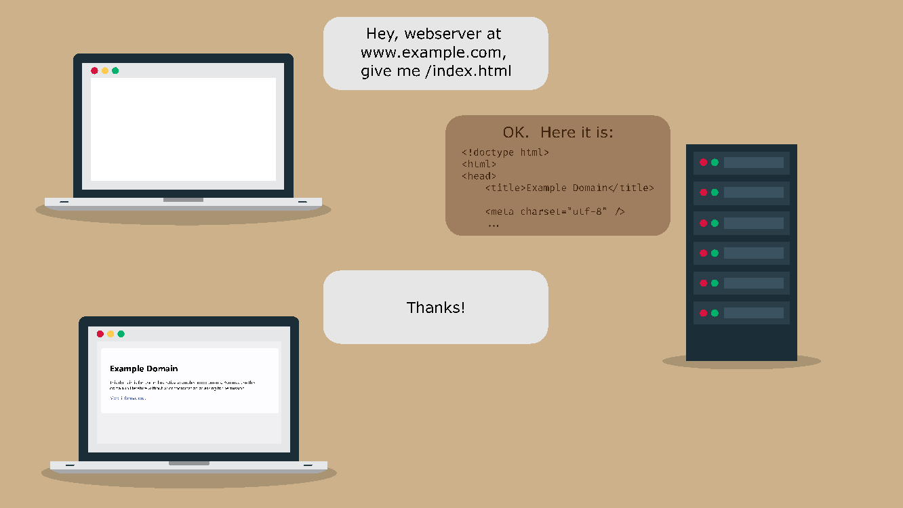

# Lecture 11
## Web Programming in Java
---
## Outline
- How Do Web Servers Work (HTTP)
- Writing an HTTP Client Application
- JakartaEE Specification
- Writing an HTTP Server Application

---
## How Do Web Servers Work (HTTP)

----

----
### The HTTP Protocol

- HTTP is **simple**
    - All the client/server communication is human-readable
- HTTP is **extensible**
    - New information can be added to requests and responses via headers
- HTTP is **stateless** (but not session-less)
    - There is no link between two requests being successively carried out on
      the same connection
    - If you need to track a session, you need Cookies

----
### Example HTTP Request

```
GET /index.html HTTP/1.1 
Host: example.com 
Connection: keep-alive 
Pragma: no-cache 
Cache-Control: no-cache 
Upgrade-Insecure-Requests: 1 
User-Agent: Mozilla/5.0 (Windows NT 10.0; Win64; x64) …
Accept: text/html,…
Accept-Encoding: gzip, deflate 
Accept-Language: en-US,en;q=0.9,it;q=0.8,es;q=0.7

```

----
### Example HTTP Request

- Requests can also optionally have **query parameters** in the form of
key-value pairs

```
https://www.google.com/search?q=test&source=hp
```

- In this simplified version of Google search request, there are three
query parameters separated by `&`
- q=test
- source=hp

----
### HTTP Methods (Verbs)

<div style="height: 600px; overflow-y: scroll;">

| Method | Conventional Meaning |
|--------|-------------|
| GET | Requests a representation of the specified resource. Requests using GET should only retrieve data. |
| HEAD | Asks for a response identical to that of a GET request, but without the response body. |
| POST | Is used to submit an entity to the specified resource, often causing a change in state or side effects on the server. |
| PUT | Replaces all current representations of the target resource with the request payload. |
| DELETE | Deletes the specified resource. |
| CONNECT | Establishes a tunnel to the server identified by the target resource. |
| OPTIONS | Is used to describe the communication options for the target resource. |
| TRACE | Performs a message loop-back test along the path to the target resource. |
| PATCH | Is used to apply partial modifications to a resource.|

</div>

----

### Example HTTP Response

```
HTTP/1.1 200 OK 
Content-Encoding: gzip 
Accept-Ranges: bytes 
Age: 269939 
Cache-Control: max-age=604800 
Content-Type: text/html; charset=UTF-8 
Date: Sun, 11 Apr 2021 16:35:54 GMT 
Etag: "3147526947+ident" 
Expires: Sun, 18 Apr 2021 16:35:54 GMT 
Last-Modified: Thu, 17 Oct 2019 07:18:26 GMT 
Server: ECS (nyb/1D2E) 
Vary: Accept-Encoding 
X-Cache: HIT Content-Length: 648

```

---
## Writing an HTTP Client Application

---
## JakartaEE Specification

- Jakarta EE, formerly Java Platform, Enterprise Edition (Java EE) and Java
2 Platform, Enterprise Edition (J2EE) is a set of specifications, extending
Java SE with specifications for enterprise features such as distributed
computing and web services. (Source: Wikipedia)

----
### Components Include

<div style="height: 600px; overflow-y: scroll;">

- **Jakarta Servlet** 
- **Jakarta RESTful Web Services (JAX-RS)**
- **Jakarta JSON Binding**
- **Jakarta Persistence (JPA)**
- **Jakarta Contexts and Dependency Injection (CDI)**
- Jakarta Server Pages (JSP)
- Jakarta Expression Language (EL)
- Jakarta Debugging Support for Other Languages (JSR-45)
- Jakarta Standard Tag Library (JSTL)
- Jakarta Faces (JSF)
- Jakarta WebSocket (WebSocket)
- Jakarta JSON Processing (JSON-P)
- Jakarta Annotations (JSR 250)
- Jakarta Enterprise Beans (EJB)
- Jakarta Transactions (JTA)
- Jakarta Bean Validation
- Jakarta Managed Beans
- Jakarta Interceptors
- Jakarta Dependency Injection
- Jakarta Security
- Jakarta Authentication

</div>

----
### Servlet Specification

- Defines a server-side
  [API](https://jakarta.ee/specifications/servlet/5.0/apidocs/jakarta/servlet/http/httpservlet) for handling HTTP Requests

```java
import java.io.*;
import javax.servlet.*;
import javax.servlet.http.*;

public class HelloWorld extends HttpServlet {
 
   private String message;

   public void init() throws ServletException {
      message = "Hello World";
   }

   public void doGet(
      HttpServletRequest request, 
      HttpServletResponse response
   ) throws ServletException, IOException {
      
      response.setContentType("text/html");

      PrintWriter out = response.getWriter();
      out.println("<h1>" + message + "</h1>");
   }

   public void destroy() {
      // do nothing.
   }
}

```


---
## Writing an HTTP Server Application

---
